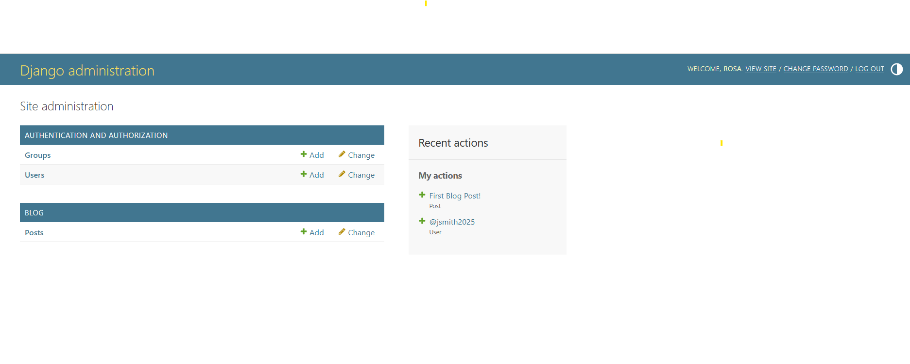

# Django Blog Tutorial

This project is part of the SDEV220 course module 04 assignment. It includes:

- Django project setup
- Blog app with posts
- Admin dashboard
- Models and migrations

## 📸 Admin Panel Screenshot

## 📝 Add Post Form

